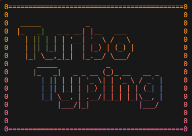

# Turbo Typing

Welcome to **Turbo Typing**, the ultimate typing speed challenge for your terminal! Test your typing skills and race against the clock to reach the top of the highscore board.

## Features

- Nostalgic gaming experience with authentic retro graphics that evoke the golden era of early gaming.
- Real-time feedback on typing accuracy and speed.
- Highscore leaderboard to track your progress or compete with friends.

## Getting Ready

Before you start playing, use the following command in your terminal to make sure you have the required npm packages installed:

```bash
npm install readline readline-sync keypress chalk chalk-animation gradient-string
```

## Try it yourself

Simply start **Turbo Typing** by executing `node app` in your terminal. Please make sure to maximize your terminal window before starting the app.

Can you climb to the top of the highscore board and become the ultimate typing champion? There's only one way to find out - happy typing! 🚀

## Preview



## Credits

**Turbo Typing** was created 2024 by Hannah Rein. Many thanks to these amazing npm packages for their contributions:

- [chalk](https://www.npmjs.com/package/chalk)
- [chalk-animation](https://www.npmjs.com/package/chalk-animation)
- [gradient-string](https://www.npmjs.com/package/gradient-string)
- [keypress](https://www.npmjs.com/package/keypress)
- [readline](https://www.npmjs.com/package/readline)
- [readline-sync](https://www.npmjs.com/package/readline-sync)
